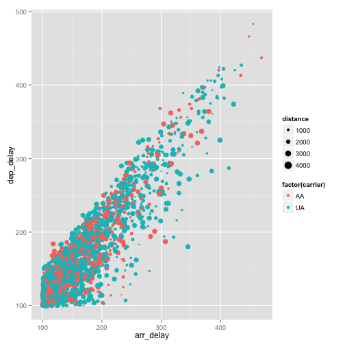
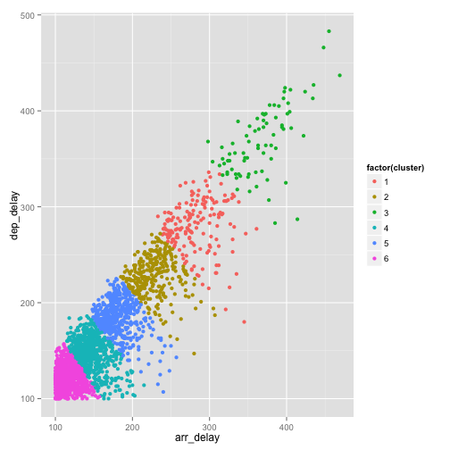

A shiny application for Exploratory Data Analysis
========================================================
author: hidekoji
date: 


========================================================
nycflights13 data

So this shiny application allows you to peform Exploratory Data Analyis against nycflights13 data.
nycflights13 contains Airline on-time data for all flights departing NYC in 2013. 


```r
library("nycflights13");head(flights[ c('dep_time','dep_delay', 'arr_time', 'arr_delay', 'carrier')])
```

```
  dep_time dep_delay arr_time arr_delay carrier
1      517         2      830        11      UA
2      533         4      850        20      UA
3      542         2      923        33      AA
4      544        -1     1004       -18      B6
5      554        -6      812       -25      DL
6      554        -4      740        12      UA
```

Arrival Delay vs Departure Delay
========================================================
By glancing the data, I'm just curious how the relationship between Arrival Delay and Departure Delay looks like, so I want to show the scatter plot like this in my shiny app to do Exploratory Data Analysis(EDA). (NOTE:It looks like Rpres does not support ggvis output so used ggplot in this slide. The plot's look and feel are different from actual shinny app)


 


Make the scatter plot dynamic
========================================================
Since the data set contains lots of data (336776 rows), you might want to filter data by delay time and carrier, so add these as Shiny UI widget


K-means Clustering Plot
========================================================
On top of the EDA, I'm also curious if these data can be clustered with K-means. So I added another plot to show this.(NOTE:It looks like Rpres does not support ggvis output so used ggplot in this slide. The plot's look and feel are different from actual shinny app)


 
